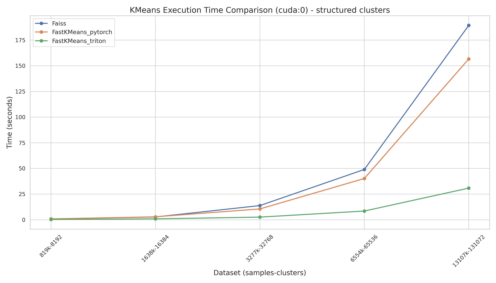

# fastkmeans


[](https://twitter.com/bclavie)
<!-- [](https://pepy.tech/project/fastkmeans) -->

_A fast and efficient k-means implementation for PyTorch, with support for GPU and CPU._

---

Welcome to `fastkmeans`! This is an extremely tiny library, meant to be slotted-in anywhere you need "fast-enough" pytorch native k-means clustering. It's compatible with both CPU and GPU, matching or outspeeding `faiss` (except in multi-GPU settings), and it comes without any install woes, relying on just two dependencies you already have installed anyway: `torch` and `numpy`.

###  Get started

```sh
[uv] pip install fastkmeans
```

... and that's all you need to do! `FastKMeans` is now ready to use.

###  So what does this do?

There's very, very little to this library. It provides a single interface, `FastKMeans`, which you can use by importing it from `fastkmeans`. This interface has been designed to be a slot-in replacement for existing FAISS implementations, while being *mostly* sklearn-compliant as well. Effectively, this means that three methods are exposed:

- train(): mimics the FAISS API, training the model on a dataset.
- fit(): mimics the sklearn API, training the model on a dataset.
- predict(): mimics the sklearn API, use the trained clusters to predict where new points belong.
- fit_predict(): mimics the sklearn API, chaining the two calls above.

#### Behaviour

Whenever possible, the library will attempt to mimic the FAISS API, albeit with a bit more flexibility. We encourage you to check out the [API docstring](https://github.com/AnswerDotAI/fastkmeans/blob/17c2a1b4cabc84c7bb0cb392fd2d2e3ec4d1b825/fastkmeans/kmeans.py#L132) to see what the arguments are, as they're very straightforward. The default behaviour of the library mostly follows faiss's, including downsampling data to a maximum of 256 points per centroid to speed up calculations, which can be freely modified and/or disabled.  The only major difference is that, by default, the library does adopt an early stopping mechanism based on a `tol` parameter, which stops the algorithm when the centroids don't move more than `tol` between iterations. This is unlike faiss', whose default behaviour is to run for a fixed number of iterations no matter what -- you can restore this behaviour by setting `tol` to -1.

#### Chunking

The algorith is implemented with a double-chunking logics, where both the data points and the centroids are split into moderately-sized chunks, avoiding the risks of OOMs. The defaults allow you to cluster 26_214_400 128-dimensional points into 262_144 clusters with ~11GB memory usage (including storing the data in fp32). You can check out the available arguments [here](https://github.com/AnswerDotAI/fastkmeans/blob/17c2a1b4cabc84c7bb0cb392fd2d2e3ec4d1b825/fastkmeans/kmeans.py#L132) to see how to tweak these. As a rule of thumb, increasing chunk sizes will speed up computations, at the cost of memory usage, and decreasing it will have the reverse effect.

###  Why `fastkmeans`?

The main motivation behind `fastkmeans` is having a considerably easier way to package late-interaction models, such as ColBERT, in both its Stanford implementation, its PyLate implentation, and for the RAGatouille high-level API. The use of clustering for ColBERT is perhaps somewhat peculiar, as it relies on **large numbers of clusters** for relatively few data points (~100 per cluster centre). This has been a major problem in getting ColBERT to be more usable, as the existing alternatives, while great in their own merit, have flaws for this particular use:

- `faiss` is highly-optimized and is the original library used by the ColBERT authors and most implementations nowadays. However, it is rather difficult to install as there are no "perfect" PyPi wheels, with many segfault issues reported, as the official install is only supported via conda or from source. It can also be finnicky, causing issues with PyTorch if not installed via conda too. Finally, and this is a major problem for maintaining libraries such as ragatouille: it requires different packages and different install methods for its `cpu` and `gpu` variant, meaning additional friction for users and the inability to provide a nice default.
- `fast-pytorch-kmeans` is a great library which provides lightning fast kmeans implementation in PyTorch: in fact, it's faster than this library! However, it relies on highly vectorized operations which are exceedingly memory hungry, and consistently OOMs on consumer hardware when trying to index even a moderate number of colbert documents (or produces suboptimal clusters with minibatching).
- `scikit-learn`, while being the ML giant whose shoulders we all stand on, only supports CPU. This becomes unusably slow when indexing larger volumes of documents, especially as there'll (almost) always be a GPU available in these situations.

There are some libraries (such as NVidia's own implementations), but they again require more dependencies than we'd like for nimble packaging, and/or are less flexible in terms of hardware.

###  Limitations

- On a few toy datasets & MNIST, `fastkmeans` reaches roughly the same NMI as `faiss` and `scikit-learn`, indicating that it creates at least somewhat coherent clusters. However, it's not extensively tested, especially in non-ColBERT uses, so your mileage may vary.
- The "chunking" defaults to avoid OOMs is rather simplistic, and you might need to tweak the numbers depending on your hardware and dataset size.
- The library currently assumes you'll be using it either on a CPU or a single GPU. Multiple GPUs don't currently provide a major speed-up, this might change in the future, though we expect users wanting to index 10M+ documents to likely have the more robust `faiss` available on their machine anyway.

### Speed

Below is `fastkmeans` benchmarked against `faiss` on a single RTX 4090 GPU, with 128-dimensional data points at various data scales that will commonly be used in ColBERT-style indexing (8192, 16384, 32768, 65536, 131072 and 262144 clusters, each with w/ cluster_size*100 data points).


